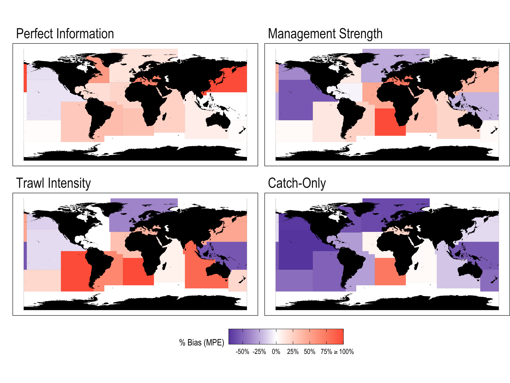

```{r xaringanExtra-freezeframe, echo=FALSE}

xaringanExtra::use_freezeframe(responsive = FALSE,overlay = TRUE)
```

```{r xaringan-tile-view, echo=FALSE}
xaringanExtra::use_tile_view()
```

```{r setup, include=FALSE}
library(xaringan)
library(xaringanExtra)
library(knitr)
library(tufte)
knitr::opts_chunk$set(echo = FALSE, message = FALSE, warning = FALSE, dev = "svg", fig.align = "center", out.width = "80%")
library(tidyverse)
library(here)

options(htmltools.dir.version = FALSE)


img_path <- here('imgs')
```

# A Quantiative Fisheries Ecologist


> I use methods and ideas from ecology and economics to help understand and manage social-ecological systems. 


I study...
  - Fisheries assessment and management
  - Social-ecological impacts of policies
  - Predictive modeling
  
Using ...
  - Bayesian methods
  - Econometrics
  - Simulation modeling
  - Open and reproducible data science
  - Collaboration

--
.center[**An Optimistic Skeptic**]


---


# Why Bayes?


Bayesian methods... 

--


- Provide **posterior probability distributions** for parameters, informed by **priors** 
  
  - "What was the probability that the protected area increased biomass by more than 10%"
  
- Give us a framework for incorporating **prior knowledge**
  
- Suited to **complex structures**

---


class: center, middle, inverse
# 

## 1. Assessing Data-Limited Fisheries

## 2. Effects of Protected Areas

## 3. Vision at UC Davis

---

class: center, middle, inverse
# Assessing Data-Limited Fisheries

---

# Fisheries Science

.center[**Understanding and managing fisheries systems**]

.pull-left[
Assessment science largely focused on two key questions


].pull-right[

`)

]
---

# Fisheries Science

.center[**Understanding and managing fisheries systems**]

.pull-left[
Assessment science largely focused on two key questions

1. How many fish are there?

].pull-right[

`)


]

---

# Fisheries Science

.center[**Understanding and managing fisheries systems**]

.pull-left[
Assessment science largely focused on two key questions

1. How many fish are there?

2. How many fish can we catch?

].pull-right[

`)

]

---


# How Many Fish Are There?

> Counting fish is just like counting trees, except they move and are invisible
> `r tufte::quote_footer('---  John Shepherd (loosely)')`

Two general options

  1. Conduct fishery-independent surveys
    - Research trawls, acoustics, visual surveys, etc.
    - Accurate (hopefully) but expensive
    
  2. Depend on data from the fishery
    - Fisheries captures
    - Catch-per-unit-effort
    - Cheaper but often biased


---

# Stock Assessments


Ideally, stock assessments fit a **population dynamics** model
    
  - Births
  - Deaths
  - Growth


using  fishery **dependent** and **independent** data

These models estimate **stock status** relative to **reference points**
  - Unfished biomass
  - Biomass that would maximize long-term catch
  - Sustainability of fishing effort

---

# A Tale of Two Fisheries

Stock assessments provide best estimates of the state of fisheries providing <br> ~50% of the world's catch. 

.center[**What about the other "data-limited" half?**]

--

.center[`)]


.right[[Hilborn *et al.* (2020)](https://www.pnas.org/content/117/4/2218)]


---


# How do we assess the "unassessed"?

We don't have good **abundance** data for most of the world's fisheries. 

We do have data on **catches**

.center[`)]

---


# Can Catches Inform Global Assessments?

.pull-left[

- Catch-only models increasingly being used to assess and manage fisheries

- Many types, but share common feature of **inferring** or **predicting** stock status based on attributes of **catch history**

- Vigorous debate as to their performance. 

].pull-right[

.center[`)]


]
---


# Assessing Data-Limited Fisheries
.pull-left[

Our Questions: 

1. How well do catch-only models work?
  
  - Spoiler: Not very well.

2. Can we make them better?
  
  - Spoiler:  Not without investment in new data

].pull-right[

.center[`)]


.right[[Hilborn *et al.* (2020)](https://www.pnas.org/content/117/4/2218)]


]
---


# [`sraplus`](https://danovando.github.io/sraplus/)

Core tool of our research: `sraplus`

Pella-Tomlinson surplus production model with process error


$$B_{t + 1} = \left(B_{t} + B_{t}\frac{r}{m - 1}\left(1 - \left(\frac{B_t}{K}\right)^{m- 1}\right) - c_t\right)p_t$$
$$log(p_t) \sim {N}\left(-\sigma_{proc}^2/2,\sigma_{proc}\right)$$

Can... 
  - Run as a catch-only model
  - Incorporate subjective or empirical priors on stock status
  - Fit to abundance index if available


---

# What Can Catches Tell Us?

What do these catch histories suggest about stock status?

--

.center[`)]


---

# Catch-Only `sraplus`

A good model should be able to **learn** something about stock status when confronted with **data**

--

.center[`)]

---


#  Catches Don't Tell Us Status
--

.center[`)]


.right[[Ovando *et al.* (2021)](https://onlinelibrary.wiley.com/doi/abs/10.1111/faf.12637)]
---

# Moving Beyond Catch-Only

- We can't **infer** stock status based on catch alone
  - We can predict some...

- There's a lot of data between "catch-only" and "full integrated stock assessment"
  - Effort reconstructions
  - Strength of fisheries management
  - Intensity of trawling
  
  Using `sraplus`, we tested the ability of different combinations of **broadly available** data to say something useful about the status of fisheries

---

# Example: Swept Area Ratio

Logic is simple: places trawled more often might have higher fishing mortality 

.center[`)]

.right[[Amoroso *et al* (2018)](http://www.pnas.org/content/early/2018/10/03/1802379115)]
---

# Translating Swept Area Ratio

The **posterior prediction** based on trawling intensity becomes **prior** for `sraplus`

.center[`)]


---


# Additional Data Helps Individual Fisheries

--
.center[`)]

.right[[Ovando *et al.* (2021)](https://onlinelibrary.wiley.com/doi/abs/10.1111/faf.12593)]

???

<small> CMSY is popular catch-only method</small>

<small> SAR & FMI augments catches with local data on trawl fishing and strength of management </small>
---


# Little Improvement from <br> Regional Application

- On average, catch-only 25% better than a random guess
  - But, wrong status category 57% of the time...

- Augmenting with additional data helps some
  - Modest reductions in error and bias
  - Better at fishing mortality rates

- But estimates have substantial **error** and **bias**
  - Out hope might be uncertain but unbiased...

---

# Error-Prone and Biased Results


.center[]


???
.right[[Ovando *et al.* (2021)](https://onlinelibrary.wiley.com/doi/abs/10.1111/faf.12593)]

---

# How Can We Improve?

If catches alone aren't informative, what should we add on?

--

.center[`)]

.right[[Ovando *et al.* (2021)](https://onlinelibrary.wiley.com/doi/abs/10.1111/faf.12593)]
---


# Assessing Data-Limited Fisheries


.pull-left[

- Can't let the perfect be the enemy of the good

- Important to know how imperfect
  
  - Catches don't really update priors
  
-  Even with new data, high levels of error and bias

.center[**Understanding of global fisheries depends on better data, not better models**]

].pull-right[

.center[]

]
---


class: center, middle, inverse
## Effects of Protected Areas

---


# Protected Areas

Ecosystem-based management increasingly asked to meet needs of environment and society. 

Protected areas a big part of this
  - Protect 30% of land and water in the coming decade.
  - Up from single digits in global seas now

Social-ecological systems are highly complex
  - Spatial-temporal dynamics
  - Species interactions
  - Human behavior
  
Makes *predicting* and *assessing* the performance of protected areas harder than you might think. 

???
[Currently 26% MPA in US waters, 3% no-take MPAs](https://marineprotectedareas.noaa.gov/gallery/understanding-area-based-mgmt-in-us-waters.html)
---

# Leaving the Walled Garden

.pull-left[

- Early protected areas focused on providing refuge from the outside world

- Protection has wider impacts
  - "spillover" of adult or larval organisms
  - Displacement of human activities 

- This spillover both allows MPAs to provide wider benefits, but also poses major challenges. 

.center[**What effects do protected areas have on populations?**]

].pull-right[

.center[]

]

---


# MPAs - The Evidence


<br>
<br>
<br>
> The jury is in on marine reserves: They work.

> Research has repeatedly shown that fish numbers quickly climb following well-enforced fishing bans, 
> creating tangible benefits for fishers who work the surrounding waters.

.right[[NPR 2018](https://www.npr.org/sections/thesalt/2018/09/14/647441547/could-a-ban-on-fishing-in-international-waters-become-a-reality)]


---

# MPAs - The Evidence

.pull-left[

- MPAs seem simple: 
  - *Less fishing, more fish*

- Ample evidence of generically **more** inside MPAs than outside

- Problem solved?

- Few marine populations contained entirely in MPAs

- What do we do when the **treatment** affects the **control**


].pull-right[

.center[`)]

.right[[Lester *et al.* (2009)](https://www.int-res.com/abstracts/meps/v384/p33-46)]

]


---


# Population-Level Effects of MPAs

<!-- .center[`)] -->


```{r, out.width="100%", fig.align="center", eval = TRUE}
knitr::include_graphics(file.path(img_path,"bio_anim.gif"))
```

???
Relatively sedentary adults, widely dispersed larvae with post-settlement density dependence

---

# Population-Level Effects of MPAs


<!-- .center[`)] -->


```{r, out.width="100%", fig.align="center", eval=TRUE}
knitr::include_graphics(file.path(img_path,"fleet_anim.gif"))
```

???
Relatively sedentary adults, widely dispersed larvae with post-settlement density dependence


---


# Case Study: Channel Islands MPAs

.center[`)]


---

# What Happend in the Channel Islands?

Trend for species targeted by fishing... Looks promising!

.center[`)]

---

# What Happend in the Channel Islands?

But wait... 

.center[`)]

---


# Estimating Population-Level Effects

.center[`)]


---

# Estimating Population-Level Effects

.center[`)]


---


# Estimating Population-Level Effects

.center[`)]

---


# Estimating Population-Level Effects

### General form

$$(log(D_{MPA=1, T = 1})-log(D_{MPA=0, T = 1}))-(log(D_{MPA = 1,T = 0})-log(D_{MPA =0, T = 0}))$$


### Bayesian Gamma GLM 

$$d_{i} \sim Gamma(e^{\beta_0 + \beta_1T_{i} +  \beta_2MPA_{i} + \color{red}{\beta_{3}}T_iMPA_i + \mathbf{B^cX_i} + \mathbf{B^sS_i}},shape)$$


### Hierarchical clustering of sites by island
$$\mathbf{B^s} \sim N(\beta_r,\sigma_r)$$ 


---

# Population-Level Effects of MPAs

.center[`)]

.right[[Ovando *et al.* (2021)](https://conbio.onlinelibrary.wiley.com/doi/abs/10.1111/cobi.13782)]

---


## Effects of Protected Areas

.pull-left[

- Protected areas can support ecosystem-based management on land and sea

- Particularly in oceans, critical to consider effects **inside** and **outside**

-  **Population** effects may be smaller and harder to find than conventionally thought

- Does not mean there are not benefits
  - But may impede adaptive management
  
- Communities should have a clear understanding of expected effects of protected areas


].pull-right[

.center[]

]


---

class: center, middle, inverse

# Vision at UC Davis

---

class: center, middle, inverse

### A welcoming hub for interdisciplinary research on the <br> functioning and management of social-ecological systems


---

# Fishery Impacts of Protected Areas

.pull-left[
- Ecosystem-based management includes impacts of policies on **people**

- The bigger the protected area...
  - The more likely substantial conservation success
  - The less likely benefits to fisheries

- Surprisingly limited empirical evidence

- Goal at UC Davis: **Empirical research on the fishery impacts of MPAs**
  - Focus on California
  - Applications globally

]
.pull-right[

.center[`)]

]

---

# Fishery Impacts of  Protected Areas


.center[]


---

# Reducing Bycatch

.pull-left[

- Fisheries management has had many successes

- Bycatch remains a problem even in otherwise well-managed fisheries
  - Sharks, turtles, marine mammals

- Static spatial protections may struggle in a changing climate

- Goal at UC Davis: **Theory and evidence for reducing bycatch of threatened species**
  - Simulating Social-Ecological Systems with  [`marlin`](https://danovando.github.io/marlin/)

].pull-right[

.center[`)]


]

---

# Forecasting Social-Ecological Systems

.pull-left[


- Quantitative ecology often focuses on explaining what we **observe**
  - Good identification but low $R^2$

-  We also need to consider how well we can **forecast**

- Particularly as we plan ecosystem management under a changing climate

- Goal at UC Davis: **Collaborative research forecasting social-ecological systems**
].pull-right[

.center[`)]

]
---

# Forecasting Social-Ecological Systems

.center[`)]


.left[[Ovando *et al.* (2022)](https://cdnsciencepub.com/doi/10.1139/cjfas-2021-0287)]

---

# Collaboration and Open Science

.pull-left[

- Social-ecological problems are **complex**

- Require interdisciplinary collaboration to **solve**

- Open and reproducible code 
  - Facilitates collaboration
  - Improves science


.center[**Excited to help solve terrestrial and aquatic environmental problems as part of UC Davis community**]


].pull-right[

.center[]

]


---


# Thank You!

.pull-left[
Questions?

slides: [https://danovando.github.io/davis-seminar/slides](https://danovando.github.io/davis-seminar/slides)

email: danovan@uw.edu

website: [danovando.com](https://www.weirdfishes.blog/)


<a href="https://twitter.com/danovand0?ref_src=twsrc%5Etfw" class="twitter-follow-button" data-show-count="false">Follow @danovand0</a><script async src="https://platform.twitter.com/widgets.js" charset="utf-8"></script>


### Funding
  - Assessment: Food and Agriculture Organization of the United Nations
  - Protected Areas: NOAA Sea Grant Population and Ecosystem Dynamics Fellowship


].pull-right[

.center[ `)]


]


---


class: center, middle, inverse
# Extras

---


# An Optimistic Skeptic

### The skeptic... 

Someday I hope for a clear answer...

--

  - But it hasn't happened yet. 
  
**Uncertainty and complexity are the norm**

--

### The optimism...

- There are lessons in null-results

- Slow progress towards better understanding and better outcomes

**Science can help us navigate uncertainty and complexity**


???

What do I mean by an optimistic skeptic? Social-ecological systems are complicated. This both complicates our ability to clearly understand what is happening in them, and to identify simple solutions to complex problems. Hence, "skeptic": my prior is that uncertainty and complexity are the norm. Optimist though: I believe that science can help us navigate this uncertainty and complexity in a productive way, to help us move slowly towards better understanding and better outcomes. 


---

# How many fish can we catch?

Suppose we conduct a survey and find that there are 100,000 fish in the population...

--
  
  - Does this represent a large fraction of a small but unfished population?
  
  - A small fraction of a historically massive population?
  
--

Which is right has major implications for management. 

To answer this, we use a class of models broadly called *stock assessments*


---


# Improving Estimates of Global Fishery Status

.center[Why?]

--

.pull-left[
- *Nature* abhors a vacuum of global maps

- Many efforts to assess the status of global fisheries 
  - UN Sustainable Development Goals
  
- Nearly all are versions "catch-only" data-limited assessments

].pull-right[

Collage of "status of global unassessed" papers

]


---


# Catch = Fish?

.center[`)]


---


# Data Limited Stock Assessments

Most fisheries don't have the data or resources for integrated stock assessment

Growing push for cheaper, simpler, but effective methods

All trade data for assumptions, but vary in their details

  - Indicator based
  - Length based
  - Catch based

**How well do they work and how good is good enough?**


---

# Catch often != Fish

For those not impressed by simulations, here are some real world data

.center[`)]

---

# Inside vs. Outside: Channel Islands

.center[`)]

---

# Forecasting Salmon by Age Group

.center[`)]

---


# Forecasting with Ensembles

.center[`)]


---

# Innovations in Assessment and Management

.center[]


---

# Code is a Tool. 

.pull-left[

- Just because we can code it doesn't mean it's right

- Coding is easy (relatively speaking). 

- Ideas are hard
  - ideas should drive code, not *vice versa*
  
- We need to be willing to put our computer games to the test

].pull-right[

.center[]

]


---

# Inside vs. Outside = Effect?

.center[When MPA doesn't affect outside, *response ratio* is a good indicator]
--

.center[`)]


---

# Inside vs. Outside = Effect?

.center[When MPAs affect the outside, *response ratio* is a poor indicator]


--

.center[]

---
# Anatomy of a Catch-Only Model

.pull-left[

Given a catch history and a population model...

1. Construct **prior distributions** of parameters
  - growth rate, carrying capacity, initial and final stock status
  
2. Sample parameters from prior distributions and apply to catch history + model

3. **reject** combinations of parameters that crash the population or **don't conform to status priors**


].pull-right[


]

---

# Simulating Social-Ecological Systems with  [`marlin`](https://danovando.github.io/marlin/)

.center[]


---


